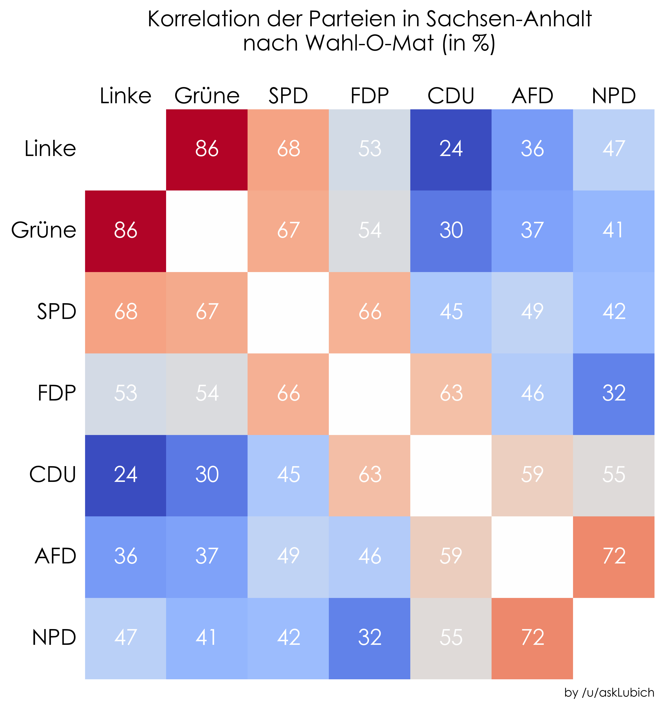

# Analysing the Wahl-O-Mat about the 2016 Sachsen-Anhalt election

### Results

The figure below shows how well two political parties aggree (using a normalized L1-distance) based on the answers provided to the Wahl-O-Mat. 
Here, 100% denotes full aggreement.

### Prerequisites

* Python 2.7
* Jupyter Notebook
* Packages:
    * matplotlib
    * numpy
    
### License

This project is licensed under the GPL-3.0 - see the [LICENSE](LICENSE) file for details.